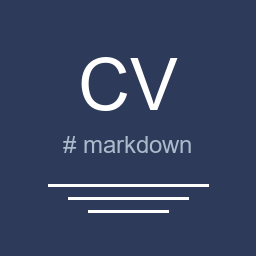

<p align="center">
  
</p>

<h1 align="center">MarkdownCV</h1>

<p align="center">
  <strong>Write your CV in Markdown. Get a professional PDF.</strong>
</p>

<p align="center">
  <a href="https://marketplace.visualstudio.com/items?itemName=archcastro.markdowncv">
    
  </a>
  <a href="https://github.com/LirielC/MarkdownCV">
    
  </a>
  <a href="https://github.com/LirielC/MarkdownCV/actions/workflows/ci.yml">
    
  </a>
  
  
</p>

---

## The Problem

Developers write resumes in Markdown, but converting to a professional PDF is painful:

- Templates are hard to maintain
- ATS compatibility is a guessing game
- Every export requires manual tweaks

## The Solution

**MarkdownCV** turns any `.md` file into a polished, ATS-optimized PDF — directly from VS Code, with one command.

---

## Features

| Feature | Description |
|---|---|
| **Markdown to PDF** | Convert `.md` to professional A4 PDF with one command |
| **ATS-Optimized Layout** | Clean, single-column design that passes Applicant Tracking Systems |
| **ATS Score** | Analyze your CV against a job description — see which keywords match |
| **NLP Mode (optional)** | Python + spaCy integration for semantic keyword analysis |
| **Section Validation** | Warns if essential sections are missing (Name, Experience, Education...) |
| **Multiple Templates** | Drop a `.css` file in `templates/` and it's instantly available |
| **Bilingual UI** | Portuguese and English — auto-detected from VS Code settings |
| **Offline First** | Works without internet. No API keys needed. |

---

## Quick Start

### 1. Install

Open VS Code, press `Ctrl+Shift+X`, search **"MarkdownCV"** and install.

> **Requires:** Google Chrome or Microsoft Edge (used for PDF rendering via puppeteer-core)

### 2. Generate PDF

1. Open your `.md` resume
2. `Ctrl+Shift+P` then select **MarkdownCV: Generate PDF**
3. PDF is saved next to your `.md` file

### 3. Check ATS Score

1. Copy a job description to your clipboard
2. Open your `.md` resume
3. `Ctrl+Shift+P` then select **MarkdownCV: ATS Score (Keyword Analysis)**
4. See results in the Output panel:

```
=== ATS Score ===
Mode: BASIC
Score: 73%

Keywords found (11):
  + javascript
  + react
  + node.js
  + typescript
  + docker

Missing keywords (4):
  - kubernetes
  - terraform
  - aws
  - graphql
```

---

## CV Format

Your Markdown should include these sections:

```markdown
# Your Full Name

email@example.com | (00) 00000-0000 | City, State
[linkedin.com/in/you](https://linkedin.com/in/you) | [github.com/you](https://github.com/you)

## Professional Summary

Brief summary highlighting your experience and key skills.

## Experience

### Job Title
**Company Name** | Jan 2023 – Present

- Built REST APIs serving 50k+ requests/day with Node.js
- Migrated legacy frontend to React, reducing load time by 40%

## Education

**University Name**
Computer Science | 2017 – 2021

## Skills

| | |
|---|---|
| **Languages** | JavaScript, TypeScript, Python |
| **Frameworks** | React, Node.js, Express |
| **Databases** | PostgreSQL, MongoDB, Redis |
| **DevOps** | Docker, Git, GitHub Actions |

## Languages

- Portuguese – Native
- English – Advanced
```

> The extension validates sections in both **Portuguese** and **English**.

---

## Advanced: NLP Mode

For deeper keyword analysis using Natural Language Processing, install Python dependencies:

```bash
pip install spacy
python -m spacy download pt_core_news_sm   # Portuguese
# or
python -m spacy download en_core_web_sm    # English
```

When available, ATS Score automatically upgrades to NLP mode:

- **Lemmatization** — matches "developing" with "development"
- **Named Entity Recognition** — extracts technologies and companies
- **Bigrams** — catches terms like "machine learning", "ci/cd"
- **Semantic Similarity** — overall match score between CV and job description

---

## Custom Templates

Create your own template:

1. Add a `.css` file to the `templates/` folder
2. Run **MarkdownCV: Generate PDF**
3. If multiple templates exist, you'll be prompted to choose

The default template uses:

- **Roboto** font family (9pt, ATS-safe)
- **A4** format with 18mm margins
- Clean section headers with divider lines
- Compact spacing optimized for one-page resumes

---

## Architecture

```
Markdown (.md)
     |
 [Parser]         Validates required sections
     |
 [markdown-it]    Converts to HTML
     |
 [CSS Template]   Applies professional styling
     |
 [puppeteer-core] Renders to PDF using Chrome/Edge
     |
 Professional PDF
```

| Module | Responsibility | Dependency |
|---|---|---|
| `parser.ts` | Section validation (PT/EN) | None |
| `htmlBuilder.ts` | Markdown to HTML | markdown-it |
| `pdfGenerator.ts` | HTML to PDF | puppeteer-core |
| `atsAnalyzer.ts` | Keyword analysis (hybrid) | Optional: Python/spaCy |
| `i18n.ts` | PT/EN localization | None |
| `template.ts` | CSS template management | None |

---

## Contributing

1. Fork the repository
2. Create a feature branch (`git checkout -b feature/my-feature`)
3. Make your changes
4. Run tests: `npm test`
5. Submit a Pull Request

```bash
git clone https://github.com/LirielC/MarkdownCV.git
cd MarkdownCV
npm install
npm run compile
# Press F5 in VS Code to test
```

---

## License

[MIT](LICENSE)
